# MediaShare Webapp - Screenshots

## Mobile View

### Login Screen

A preview of the **login screen**, where users can login.

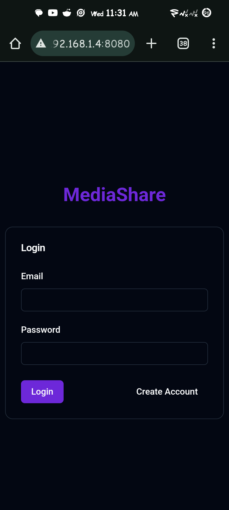

### Register Screen

A preview of the **register screen**, where users can register new accounts.

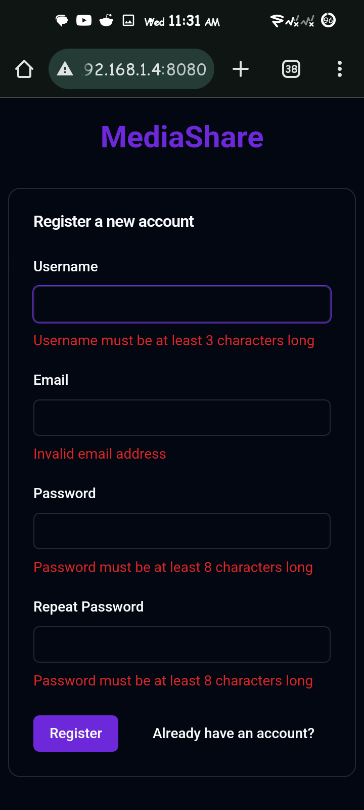

### Content Screen

A preview of the **content/home screen**, where users can view shared media,
react with likes.

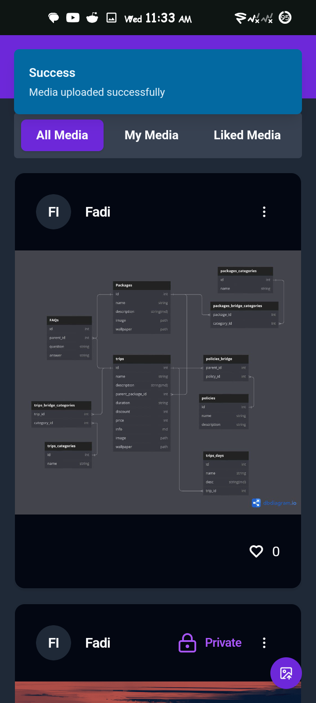

### Edit Media Dialog

The **media edit dialog** allows users to edit their media and toggle visibility
state.

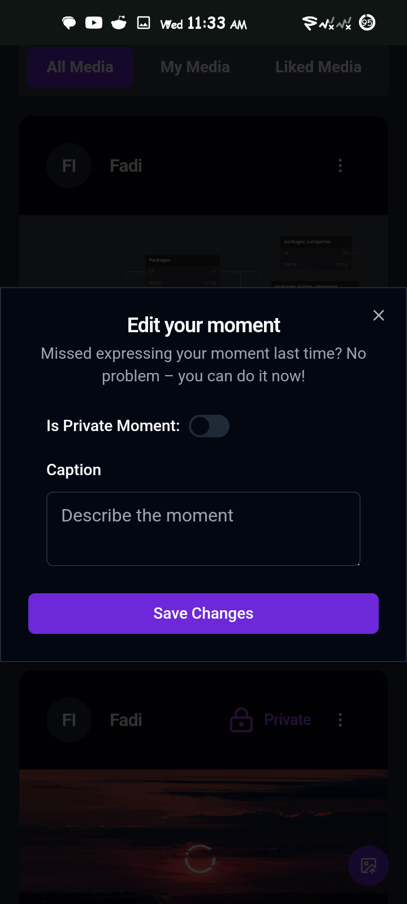

### Upload Media Sheet

The bottom **upload sheet** allows users to upload and share media.

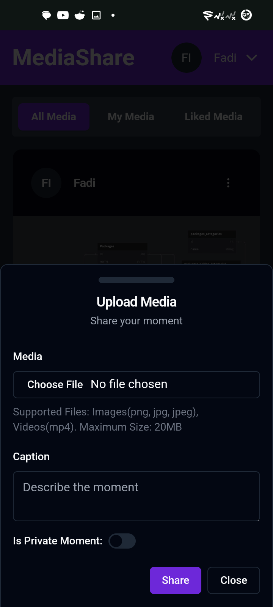

---

## Desktop View

### Login Screen

A preview of the **login screen**, where users can login.

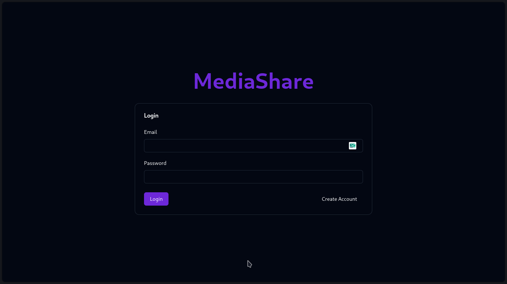

### Register Screen

A preview of the **register screen**, where users can register new accounts.

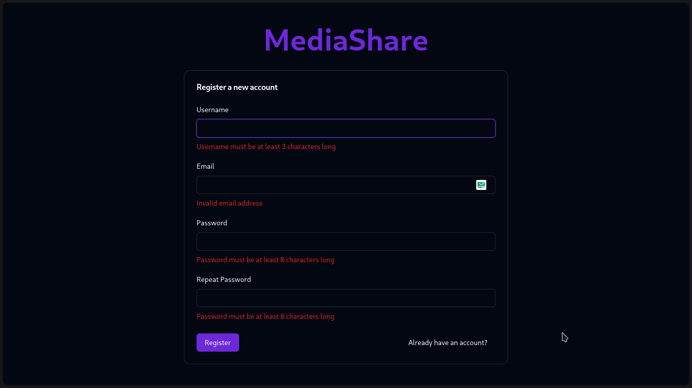

After a successful registration, the **login screen** is shown with a toast.

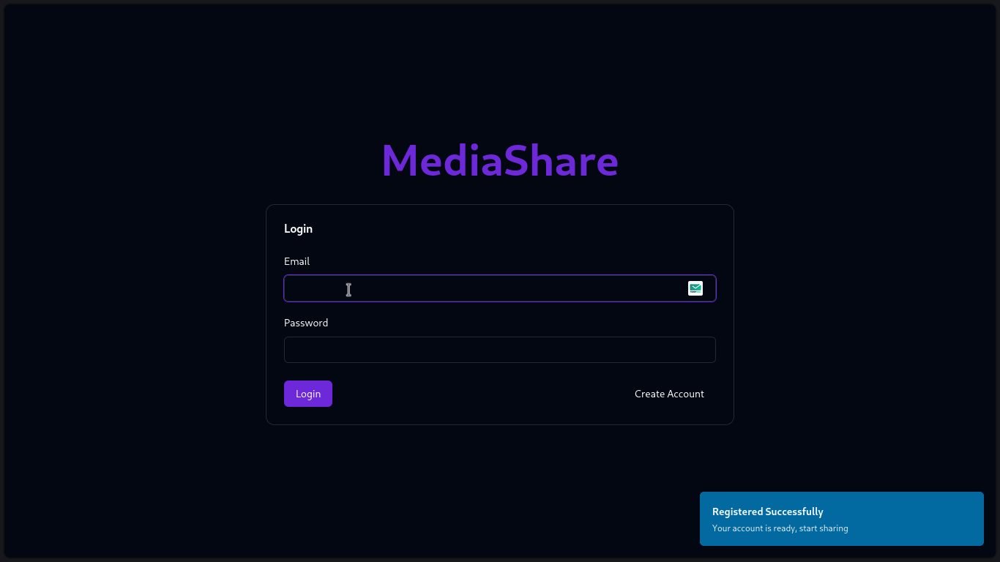

### Content Screen

A preview of the **content/home screen**, where users can view shared media,
react with likes.

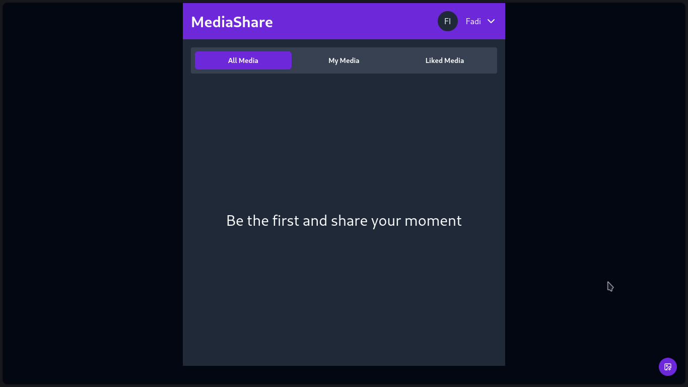

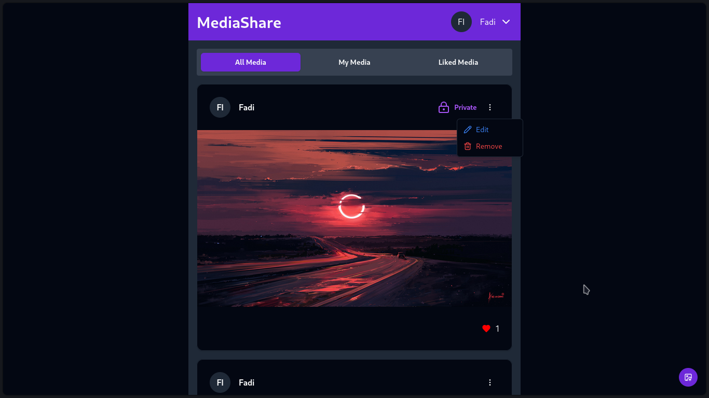

### Edit Media Dialog

The **media edit dialog** allows users to edit their media and toggle visibility
state.

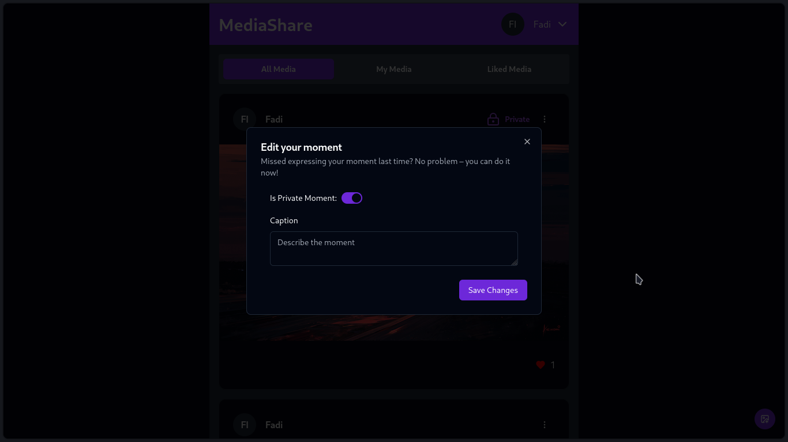

### Upload Media Sheet

The bottom **upload sheet** allows users to upload and share media.

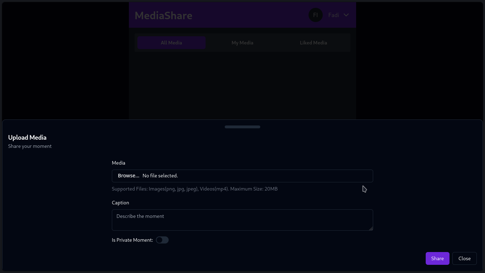
